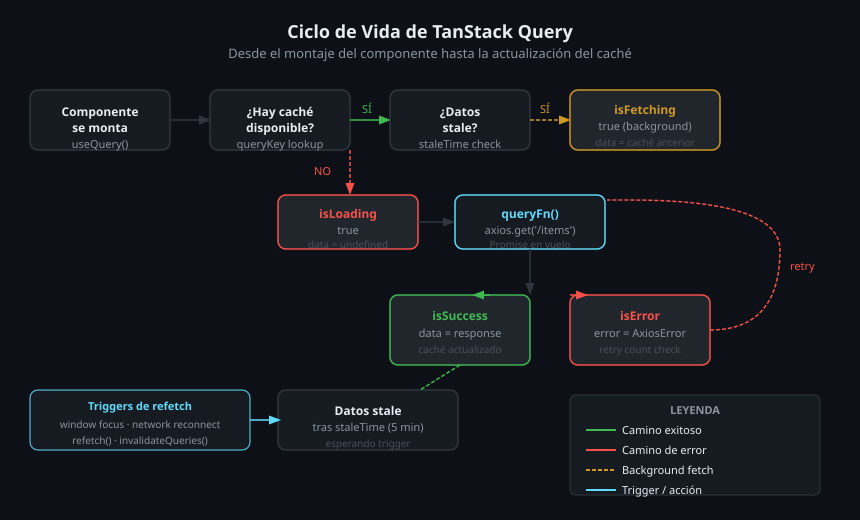
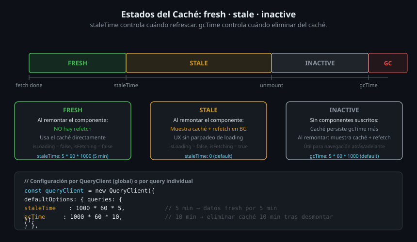

# TanStack Query v5 en React Native

## 🎯 Objetivos

- Configurar `QueryClient` y `QueryClientProvider`
- Usar `useQuery` para obtener datos del servidor
- Usar `useMutation` para crear, editar y eliminar
- Invalidar el caché con `queryClient.invalidateQueries`
- Entender los estados `fresh`, `stale`, `paused` y `gcTime` / `staleTime`

---

## 1. ¿Qué es TanStack Query?

TanStack Query (antes React Query) es una librería de **server state management**. Gestiona el caché de los datos que vienen de una API: cuándo están frescos, cuándo refrescar, cómo manejar errores y loading states.

> **Regla clave**: El estado del servidor (datos de API) va en TanStack Query.
> El estado de UI (modal abierto, tab activo) va en Zustand.
> **Nunca copies datos de API dentro de un store Zustand.**



---

## 2. Configuración Inicial

```tsx
// App.tsx — configurar QueryClientProvider una sola vez en la raíz
import { QueryClient, QueryClientProvider } from '@tanstack/react-query';
import { NavigationContainer } from '@react-navigation/native';
import { SafeAreaProvider } from 'react-native-safe-area-context';

const queryClient = new QueryClient({
  defaultOptions: {
    queries: {
      staleTime: 1000 * 60 * 5,  // 5 minutos — datos "frescos" por 5 min
      retry: 2,                    // Reintentar 2 veces ante error de red
    },
  },
});

export default function App(): React.JSX.Element {
  return (
    <QueryClientProvider client={queryClient}>
      <SafeAreaProvider>
        <NavigationContainer>
          {/* Resto de la app */}
        </NavigationContainer>
      </SafeAreaProvider>
    </QueryClientProvider>
  );
}
```

---

## 3. `useQuery` — Leer Datos

```tsx
import { useQuery } from '@tanstack/react-query';
import { fetchPosts } from '../services/postsService';
import type { Post } from '../types';

function PostsScreen(): React.JSX.Element {
  const {
    data,        // Los datos tipados (Post[] | undefined)
    isLoading,   // true solo en el primer fetch (sin caché previo)
    isFetching,  // true en cualquier fetch, incluyendo refetches en segundo plano
    isError,
    error,
    refetch,     // Para pull-to-refresh
  } = useQuery<Post[]>({
    queryKey: ['posts'],       // Identificador único del caché — puede incluir parámetros
    queryFn: fetchPosts,       // La función que llama a la API
  });

  if (isLoading) return <ActivityIndicator />;
  if (isError) return <Text>Error: {(error as Error).message}</Text>;

  return (
    <FlatList
      data={data}
      keyExtractor={(item) => String(item.id)}
      renderItem={({ item }) => <PostCard post={item} />}
      onRefresh={refetch}
      refreshing={isFetching}
    />
  );
}
```

### QueryKey — Siempre un Array

La `queryKey` identifica y distingue las queries en caché:

```ts
['posts']                    // Todos los posts
['posts', userId]            // Posts de un usuario específico
['posts', { page, search }]  // Posts con paginación y búsqueda
['post', id]                 // Un post individual por id
```

---

## 4. `useMutation` — Escribir Datos

```tsx
import { useMutation, useQueryClient } from '@tanstack/react-query';
import { createPost } from '../services/postsService';

function NewPostForm(): React.JSX.Element {
  const queryClient = useQueryClient();

  const { mutate, isPending } = useMutation({
    mutationFn: createPost,

    onSuccess: () => {
      // Invalida el caché de 'posts' → dispara un refetch automático
      queryClient.invalidateQueries({ queryKey: ['posts'] });
    },

    onError: (error) => {
      console.error('Failed to create post:', error);
    },
  });

  return (
    <Pressable
      onPress={() => mutate({ title: 'Nuevo', body: 'Contenido', userId: 1 })}
      disabled={isPending}
    >
      <Text>{isPending ? 'Guardando...' : 'Crear Post'}</Text>
    </Pressable>
  );
}
```

---

## 5. Estados del Caché



| Estado | Descripción |
|--------|-------------|
| **fresh** | Datos recientes — no refetch aunque el componente se remonte |
| **stale** | Datos posiblemente desactualizados — refetch en background al montar |
| **paused** | Sin red — la query espera reconexión |
| **inactive** | Sin suscriptores — programado para eliminarse según `gcTime` |

```ts
// Configuración por query individual
useQuery({
  queryKey: ['config'],
  queryFn: fetchConfig,
  staleTime: Infinity,   // Nunca se vuelve stale (datos estáticos)
  gcTime: 1000 * 60,    // Eliminar caché 1 min después de desmontarse
});
```

---

## 6. Patrón Completo: Servicio + Hook + Pantalla

```
src/
├── services/
│   └── postsService.ts   ← funciones puras que llaman a apiClient
├── hooks/
│   └── usePosts.ts       ← custom hook que envuelve useQuery/useMutation
└── screens/
    └── PostsScreen.tsx   ← consume el hook, solo renderiza UI
```

```ts
// src/hooks/usePosts.ts — encapsula la lógica de fetching
export function usePosts() {
  return useQuery<Post[]>({
    queryKey: ['posts'],
    queryFn: fetchPosts,
  });
}

export function useCreatePost() {
  const queryClient = useQueryClient();
  return useMutation({
    mutationFn: createPost,
    onSuccess: () => queryClient.invalidateQueries({ queryKey: ['posts'] }),
  });
}
```

---

## ✅ Checklist de Verificación

- [ ] `QueryClientProvider` en la raíz, fuera de `NavigationContainer`
- [ ] `queryKey` es un array descriptivo (no un string suelto)
- [ ] `queryFn` retorna una Promise con los datos tipados
- [ ] `isLoading` y `isError` manejados antes de renderizar `data`
- [ ] `useMutation` invalida el caché en `onSuccess`
- [ ] Pull-to-refresh usa `refetch` + `refreshing={isFetching}`
