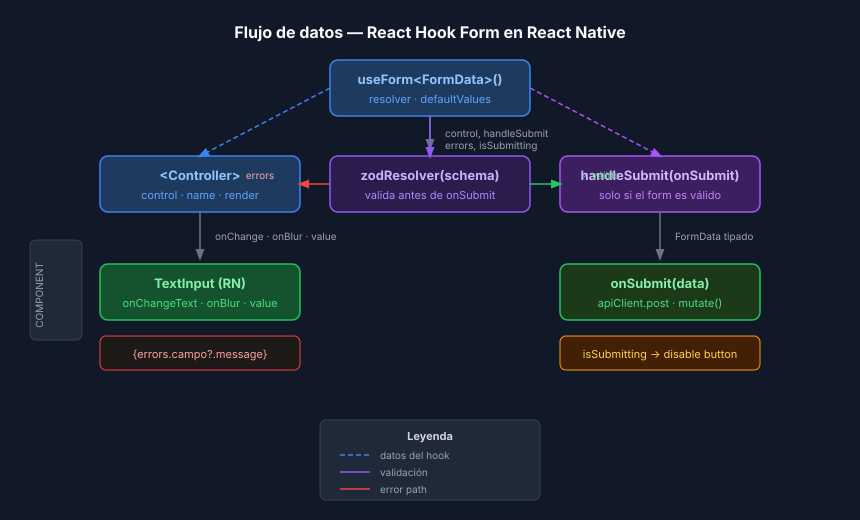

# React Hook Form en React Native

## 🎯 Objetivos

- Entender por qué React Hook Form es preferible a `useState` para formularios
- Crear formularios controlados con `useForm` y `Controller`
- Manejar envíos con `handleSubmit` y estados con `formState`

## 📋 Contenido

### 1. ¿Por qué React Hook Form?

En React web se puede usar el atributo `ref` directamente en un `<input>`. En React
Native, `TextInput` no expone su `ref` de la misma forma, por lo que React Hook Form
proporciona `Controller` para adaptarse a cualquier componente nativo.

| Enfoque | Problema |
|---------|---------|
| `useState` por campo | Re-render en cada tecla; validación manual verbosa |
| `ref` nativo | No funciona igual en React Native |
| React Hook Form + `Controller` | Re-renders mínimos; validación declarativa |

### 2. Instalación

```bash
pnpm add react-hook-form@7.72.1
```

### 3. `useForm` — el hook central

```tsx
import { useForm } from 'react-hook-form';

interface LoginFormData {
  email: string;
  password: string;
}

export function LoginScreen(): React.JSX.Element {
  const {
    control,          // conecta Controller con el form
    handleSubmit,     // envuelve onSubmit con la lógica de validación
    formState: {
      errors,         // errores por campo: errors.email?.message
      isSubmitting,   // true mientras onSubmit está en ejecución
      isDirty,        // true si algún campo cambió desde defaultValues
    },
    reset,            // reinicia el formulario a defaultValues
  } = useForm<LoginFormData>({
    defaultValues: { email: '', password: '' },
  });
```

### 4. `Controller` — el puente con TextInput

`Controller` recibe `control`, `name` y una función `render`. El `render` recibe
`field` con las props que necesita el componente de input.

```tsx
import { Controller } from 'react-hook-form';
import { TextInput, Text } from 'react-native';

// Dentro del componente, después de useForm:
<Controller
  control={control}
  name="email"
  render={({ field: { onChange, onBlur, value } }) => (
    <TextInput
      value={value}
      onChangeText={onChange}   // en RN es onChangeText, no onChange
      onBlur={onBlur}           // marca el campo como "tocado"
      keyboardType="email-address"
      autoCapitalize="none"
    />
  )}
/>
{errors.email && <Text>{errors.email.message}</Text>}
```

> **Diferencia con React web**: en HTML `onChange` recibe un `Event`; en React Native
> `onChangeText` recibe directamente el `string`. `Controller` conecta ambos.

### 5. `handleSubmit` — enviar el formulario

```tsx
async function onSubmit(data: LoginFormData): Promise<void> {
  // data está tipado con LoginFormData y validado
  await apiClient.post('/auth/login', data);
}

// En el JSX:
<Pressable
  onPress={handleSubmit(onSubmit)}
  disabled={isSubmitting}
>
  {isSubmitting
    ? <ActivityIndicator />
    : <Text>Iniciar sesión</Text>
  }
</Pressable>
```

`handleSubmit` solo llama `onSubmit` si el formulario pasa validación. Si hay errores,
los pone en `formState.errors` sin llamar a `onSubmit`.

### 6. `defaultValues` y `reset` en formularios de edición

Para formularios de edición (datos cargados desde la API):

```tsx
const { data: item } = useItemById(id);
const { control, handleSubmit, reset } = useForm<FormData>({
  defaultValues: { title: '', body: '' },
});

// Cargar datos cuando lleguen del servidor
useEffect(() => {
  if (item) {
    reset({ title: item.title, body: item.body });
  }
}, [item, reset]);
```

> Usar `reset` en lugar de `setValue` campo a campo — es más eficiente y marca `isDirty`
> correctamente.

## 📊 Diagrama de flujo



## ✅ Checklist

- [ ] `useForm<FormData>` con `defaultValues` definidos
- [ ] Cada `TextInput` envuelto en `Controller` con `control` y `name`
- [ ] `onChangeText={onChange}` y `onBlur={onBlur}` en el `TextInput`
- [ ] `handleSubmit(onSubmit)` en el `onPress` del botón
- [ ] Botón deshabilitado con `isSubmitting`
- [ ] Formularios de edición usan `reset()` en `useEffect`
