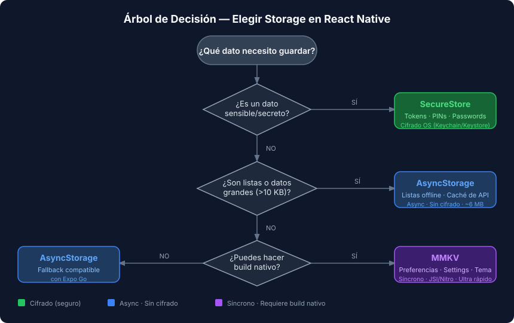

# Persistencia Local en React Native — Panorama General

## 🎯 Objetivos

- Comprender las tres opciones de storage y sus diferencias
- Seleccionar la herramienta correcta según el caso de uso
- Entender el modelo mental: memoria volátil vs. disco persistente

---

## 1. ¿Por qué no alcanza con `useState`?

En React web y React Native, `useState` vive en **memoria RAM**. Al cerrar la app, toda esa información desaparece. La persistencia local escribe datos en el **sistema de archivos del dispositivo** o en almacenes del SO protegidos por Keychain (iOS) o Keystore (Android).

```tsx
// ❌ Se pierde al reiniciar la app
const [theme, setTheme] = useState<'light' | 'dark'>('dark');

// ✅ Sobrevive reinicios — persiste en disco
const theme = storage.getString('theme') ?? 'dark';
//            ^ MMKV — sincrónico, en disco
```

---

## 2. Las tres herramientas

### 2.1 AsyncStorage

Almacén **clave-valor basado en strings**, asíncrono. Incluido en React Native de forma separada desde 0.59.

```tsx
import AsyncStorage from '@react-native-async-storage/async-storage';

// Guardar un string
await AsyncStorage.setItem('theme', 'dark');

// Guardar un objeto (necesita serialización manual)
await AsyncStorage.setItem('user', JSON.stringify({ id: 1, name: 'Ana' }));

// Leer
const theme = await AsyncStorage.getItem('theme');
const raw = await AsyncStorage.getItem('user');
const user = raw ? JSON.parse(raw) : null;

// Eliminar
await AsyncStorage.removeItem('theme');
```

**Límites**: ~6 MB en Android (configurable), sin cifrado.

---

### 2.2 MMKV (`react-native-mmkv`)

Motor de almacenamiento de WeChat, exponencialmente más rápido que AsyncStorage. Opera de forma **sincrónica** gracias a JSI/Nitro — no requiere `await`.

> ⚠️ **Requiere build nativo** — no funciona en Expo Go.
> Ejecuta `pnpm expo run:ios` o `pnpm expo run:android` para un dev build.

```tsx
import { MMKV } from 'react-native-mmkv';

// Crear instancia (una vez, a nivel global o en módulo)
export const storage = new MMKV();

// Sincrónico — sin await
storage.set('sortOrder', 'asc');
storage.set('pageSize', 20);
storage.set('darkMode', true);

const sortOrder = storage.getString('sortOrder'); // 'asc' | undefined
const pageSize  = storage.getNumber('pageSize');  // 20 | undefined
const darkMode  = storage.getBoolean('darkMode'); // true | undefined

// Eliminar
storage.delete('sortOrder');
```

MMKV incluye **hooks reactivos** que re-renderizan el componente cuando el valor cambia:

```tsx
import { useMMKVString, useMMKVBoolean } from 'react-native-mmkv';

function SettingsScreen(): React.JSX.Element {
  const [sortOrder, setSortOrder] = useMMKVString('sortOrder');
  const [darkMode, setDarkMode]   = useMMKVBoolean('darkMode');

  return (
    <Switch value={darkMode ?? false} onValueChange={setDarkMode} />
  );
}
```

---

### 2.3 Expo SecureStore

Almacena datos **cifrados** en Keychain (iOS) o Keystore (Android). Ideal para tokens, contraseñas y PINs.

```tsx
import * as SecureStore from 'expo-secure-store';

// Guardar — siempre strings
await SecureStore.setItemAsync('access_token', 'eyJhbGciOiJIUzI1NiIs...');

// Leer
const token = await SecureStore.getItemAsync('access_token');
// null si no existe

// Eliminar
await SecureStore.deleteItemAsync('access_token');
```

**Límites**: ~2 KB por clave. No usar para datos grandes.

---

## 3. Tabla de decisión



| Criterio | MMKV | AsyncStorage | SecureStore |
|----------|------|--------------|-------------|
| API | Síncrona | Asíncrona (`async/await`) | Asíncrona |
| Cifrado | No | No | Sí (OS-level) |
| Tamaño máximo | Grande (MB/GB) | ~6 MB Android | ~2 KB / key |
| Velocidad | Extremadamente rápido | Moderado | Moderado |
| Expo Go | ❌ Necesita build | ✅ Compatible | ✅ Compatible |
| Uso ideal | Preferencias, settings, caché rápida | Listas offline, datos de usuario | Tokens, contraseñas, PINs |

### Regla mnemotécnica

- **¿Es sensible?** → **SecureStore** (Keychain/Keystore)
- **¿Es grande (listas)?** → **AsyncStorage** (texto serializado)
- **¿Es frecuente y pequeño?** → **MMKV** (preferencias, settings)

---

## 4. Patrón común: custom hook de preferencias

Encapsular AsyncStorage en un hook evita repetir `setItem`/`getItem` en cada pantalla:

```tsx
// src/hooks/usePreference.ts
import { useState, useEffect } from 'react';
import AsyncStorage from '@react-native-async-storage/async-storage';

export function usePreference<T>(
  key: string,
  defaultValue: T,
): [T, (value: T) => Promise<void>] {
  const [value, setValue] = useState<T>(defaultValue);

  useEffect(() => {
    AsyncStorage.getItem(key).then((raw) => {
      if (raw !== null) setValue(JSON.parse(raw) as T);
    });
  }, [key]);

  async function persist(newValue: T): Promise<void> {
    setValue(newValue);
    await AsyncStorage.setItem(key, JSON.stringify(newValue));
  }

  return [value, persist];
}
```

---

## ✅ Checklist de Verificación

- [ ] Identifico cuándo usar cada storage sin dudar
- [ ] Puedo leer y escribir en AsyncStorage con `JSON.stringify`/`JSON.parse`
- [ ] Sé que MMKV necesita build nativo (no Expo Go) y por qué
- [ ] Nunca guardo tokens en AsyncStorage sin cifrar
- [ ] Tengo el modelo mental de "memoria volátil vs. disco persistente"
