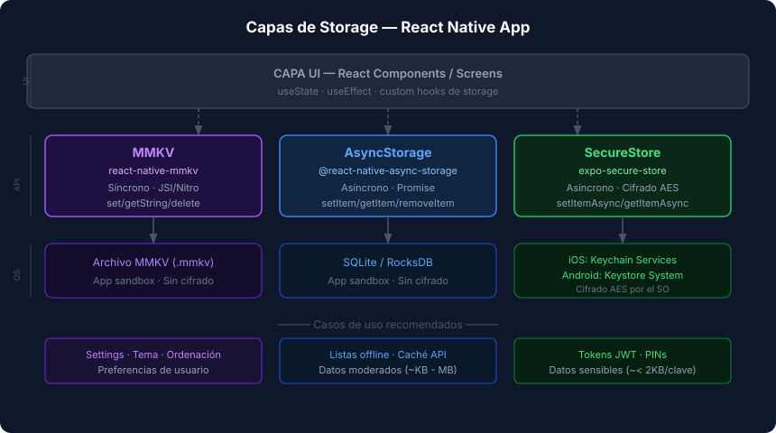

# MMKV y SecureStore — Patrones Avanzados

## 🎯 Objetivos

- Implementar custom hooks correctamente tipados para MMKV
- Entender el ciclo de vida de un token con SecureStore
- Combinar TanStack Query con AsyncStorage para caché offline

---

## 1. MMKV — Instancia global y hooks reactivos

El patrón recomendado es crear **una única instancia** de MMKV a nivel de módulo y exportarla:

```typescript
// src/storage/mmkv.ts
import { MMKV } from 'react-native-mmkv';

// Instancia global — el ID es opcional pero útil para múltiples instancias
export const storage = new MMKV({ id: 'app-storage' });
```

Luego, importa `storage` desde cualquier pantalla o hook. Los hooks `useMMKVString`, `useMMKVBoolean` y `useMMKVNumber` actúan como `useState` pero respaldado por disco:

```tsx
import { useMMKVString, useMMKVBoolean, useMMKVNumber } from 'react-native-mmkv';
import { storage } from '../storage/mmkv';

function SettingsScreen(): React.JSX.Element {
  // useMMKVString recibe la instancia como segundo argumento
  const [sortOrder, setSortOrder] = useMMKVString('sortOrder', storage);
  const [darkMode, setDarkMode]   = useMMKVBoolean('darkMode', storage);
  const [pageSize, setPageSize]   = useMMKVNumber('pageSize', storage);

  // Cuando setSortOrder('desc') se llama, el componente re-renderiza automáticamente
  // y el nuevo valor queda guardado en disco sin await
  return (/* ... */);
}
```

### Hook personalizado de preferencias (MMKV)

Encapsular la instancia evita importar `storage` en cada componente:

```typescript
// src/hooks/usePreferences.ts
import { useMMKVString, useMMKVBoolean, useMMKVNumber } from 'react-native-mmkv';
import { storage } from '../storage/mmkv';

// Clave de cada preferencia definida como constante para evitar typos
const KEYS = {
  SORT_ORDER: 'pref_sortOrder',
  DARK_MODE:  'pref_darkMode',
  PAGE_SIZE:  'pref_pageSize',
} as const;

export function usePreferences() {
  const [sortOrder, setSortOrder] = useMMKVString(KEYS.SORT_ORDER, storage);
  const [darkMode, setDarkMode]   = useMMKVBoolean(KEYS.DARK_MODE, storage);
  const [pageSize, setPageSize]   = useMMKVNumber(KEYS.PAGE_SIZE, storage);

  return {
    sortOrder: sortOrder ?? 'asc',
    setSortOrder,
    darkMode: darkMode ?? false,
    setDarkMode,
    pageSize: pageSize ?? 10,
    setPageSize,
  };
}
```

---

## 2. SecureStore — ciclo de vida del token

El patrón de autenticación con SecureStore aplica de forma consistente en toda la app:

```typescript
// src/services/tokenService.ts
import * as SecureStore from 'expo-secure-store';

const ACCESS_TOKEN_KEY  = 'sec_access_token';
const REFRESH_TOKEN_KEY = 'sec_refresh_token';

export async function saveTokens(
  accessToken: string,
  refreshToken: string,
): Promise<void> {
  // setItemAsync cifra con AES en Android y SecureEnclave en iOS
  await SecureStore.setItemAsync(ACCESS_TOKEN_KEY, accessToken);
  await SecureStore.setItemAsync(REFRESH_TOKEN_KEY, refreshToken);
}

export async function getAccessToken(): Promise<string | null> {
  return SecureStore.getItemAsync(ACCESS_TOKEN_KEY);
}

export async function clearTokens(): Promise<void> {
  await SecureStore.deleteItemAsync(ACCESS_TOKEN_KEY);
  await SecureStore.deleteItemAsync(REFRESH_TOKEN_KEY);
}
```

> 🔐 **Regla de oro**: nunca guardar tokens en `AsyncStorage` ni `MMKV` — no están cifrados.
> SecureStore es la única opción válida para datos sensibles en producción.

---

## 3. AsyncStorage + TanStack Query — caché offline

TanStack Query maneja el estado del servidor en memoria. Para tener datos disponibles **sin red**, podemos usar `AsyncStorage` como capa de respaldo:



```typescript
// src/hooks/useItems.ts (versión con caché offline)
import { useQuery, useQueryClient } from '@tanstack/react-query';
import AsyncStorage from '@react-native-async-storage/async-storage';
import { fetchItems } from '../services/api';
import type { Item } from '../types';

const CACHE_KEY = 'cache_items';
const ITEMS_QUERY_KEY = ['items'] as const;

export function useItems() {
  return useQuery({
    queryKey: ITEMS_QUERY_KEY,
    queryFn: async (): Promise<Item[]> => {
      try {
        const data = await fetchItems();
        // Guardar en cache cuando hay red
        await AsyncStorage.setItem(CACHE_KEY, JSON.stringify(data));
        return data;
      } catch (error) {
        // Sin red — intentar leer cache
        const cached = await AsyncStorage.getItem(CACHE_KEY);
        if (cached) return JSON.parse(cached) as Item[];
        throw error; // Sin cache ni red — propagar error
      }
    },
    staleTime: 1000 * 60 * 5, // 5 minutos antes de considerarlo stale
  });
}
```

---

## 4. Zustand + Persistencia (MMKV)

Un patrón muy común es combinar Zustand (semana 04) con MMKV para persistencia automática de stores:

```typescript
// src/stores/settingsStore.ts
import { create } from 'zustand';
import { persist, createJSONStorage } from 'zustand/middleware';
import { storage } from '../storage/mmkv';

// Adaptador MMKV → interfaz estándar de Zustand persist
const mmkvStorage = {
  getItem: (key: string): string | null => storage.getString(key) ?? null,
  setItem: (key: string, value: string): void => storage.set(key, value),
  removeItem: (key: string): void => storage.delete(key),
};

interface SettingsState {
  darkMode: boolean;
  sortOrder: 'asc' | 'desc';
  setDarkMode: (value: boolean) => void;
  setSortOrder: (value: 'asc' | 'desc') => void;
}

export const useSettingsStore = create<SettingsState>()(
  persist(
    (set) => ({
      darkMode: false,
      sortOrder: 'asc',
      setDarkMode: (darkMode) => set({ darkMode }),
      setSortOrder: (sortOrder) => set({ sortOrder }),
    }),
    {
      name: 'settings-storage',         // clave MMKV
      storage: createJSONStorage(() => mmkvStorage),
    },
  ),
);
```

---

## ✅ Checklist de Verificación

- [ ] Creo una sola instancia de MMKV al nivel de módulo y la exporto
- [ ] Uso los hooks `useMMKVString`, `useMMKVBoolean` para reactividad automática
- [ ] Tengo claves de MMKV como constantes tipadas (no strings mágicos)
- [ ] Almaceno tokens SOLO en SecureStore
- [ ] Mi caché offline con AsyncStorage tiene fallback correcto (try/catch)
- [ ] Conozco el patrón Zustand + persist + MMKV para stores persistentes
