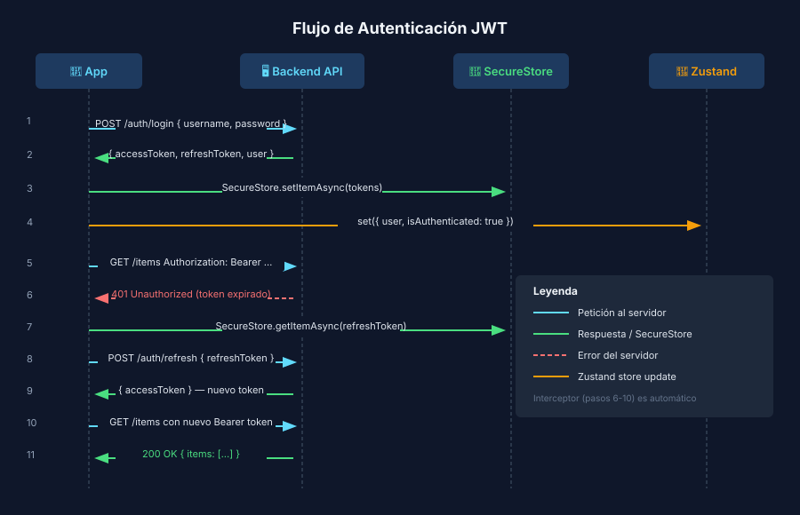

# JWT y Tokens de Autenticación

## 🎯 Objetivos

- Entender la estructura de un JWT y cómo decodificarlo
- Diseñar el ciclo de vida de access tokens y refresh tokens
- Implementar un Zustand auth store con SecureStore como backend

## 📋 Contenido

### 1. ¿Qué es un JWT?

Un **JSON Web Token** es una cadena de tres partes separadas por puntos:

```
eyJhbGciOiJIUzI1NiIsInR5cCI6IkpXVCJ9
.eyJzdWIiOiIxMjMiLCJleHAiOjE3MDAwMDAwMDB9
.SflKxwRJSMeKKF2QT4fwpMeJf36POk6yJV_adQssw5c
```

Cada parte es base64url:

| Parte | Nombre | Contenido |
|-------|--------|-----------|
| Primera | **Header** | Algoritmo de firma (`alg: "HS256"`) + tipo (`typ: "JWT"`) |
| Segunda | **Payload** | Claims: `sub` (user id), `exp` (expiry), `iat` (issued at), datos extra |
| Tercera | **Signature** | HMAC-SHA256 del header + payload con la clave secreta del servidor |

> ⚠️ El payload **no está cifrado** — cualquiera puede decodificarlo con `atob()`.
> La firma solo verifica que no fue alterado. **Nunca pongas contraseñas en un JWT.**

```ts
import { jwtDecode } from 'jwt-decode';

interface JwtPayload {
  sub: string;       // user id
  exp: number;       // Unix timestamp de expiración
  iat: number;       // Unix timestamp de creación
  email: string;     // claim personalizado
}

const token = 'eyJhbGciOiJIUzI1NiIsInR5cCI6IkpXVCJ9...';
const payload = jwtDecode<JwtPayload>(token);
console.log(payload.email);              // 'ana@example.com'
console.log(new Date(payload.exp * 1000)); // fecha de expiración
```

---

### 2. Access Token vs Refresh Token

Las APIs modernas emiten **dos tokens** con ciclos de vida distintos:

| Token | Duración típica | Almacenamiento | Propósito |
|-------|----------------|----------------|-----------|
| **Access Token** | 15 min – 1 hora | SecureStore | Autenticar cada petición en `Authorization: Bearer` |
| **Refresh Token** | 7–30 días | SecureStore | Obtener un nuevo access token cuando el anterior expira |

**Ciclo de vida:**

```
Login → [accessToken (1h), refreshToken (7d)] → guardados en SecureStore
↓
API call con Authorization: Bearer <accessToken>
↓ (si 401 Unauthorized)
POST /auth/refresh con refreshToken → nuevo accessToken
↓ (si refresh también falla)
Logout obligatorio → pantalla de login
```

---

### 3. Storing tokens: SecureStore (no AsyncStorage)

```ts
// src/services/tokenService.ts
import * as SecureStore from 'expo-secure-store';

const KEYS = { ACCESS: 'auth_access', REFRESH: 'auth_refresh' } as const;

export async function saveTokens(access: string, refresh: string): Promise<void> {
  await Promise.all([
    SecureStore.setItemAsync(KEYS.ACCESS, access),
    SecureStore.setItemAsync(KEYS.REFRESH, refresh),
  ]);
}

export async function getAccessToken(): Promise<string | null> {
  return SecureStore.getItemAsync(KEYS.ACCESS);
}

export async function getRefreshToken(): Promise<string | null> {
  return SecureStore.getItemAsync(KEYS.REFRESH);
}

export async function clearTokens(): Promise<void> {
  await Promise.all([
    SecureStore.deleteItemAsync(KEYS.ACCESS),
    SecureStore.deleteItemAsync(KEYS.REFRESH),
  ]);
}
```

---

### 4. Zustand Auth Store

```ts
// src/stores/authStore.ts
import { create } from 'zustand';
import { persist, createJSONStorage } from 'zustand/middleware';
import AsyncStorage from '@react-native-async-storage/async-storage';
import { saveTokens, clearTokens } from '../services/tokenService';
import { login as apiLogin } from '../services/authService';

interface User { id: number; email: string; username: string; }

interface AuthState {
  user: User | null;
  accessToken: string | null;
  isAuthenticated: boolean;
  login: (credentials: { username: string; password: string }) => Promise<void>;
  logout: () => Promise<void>;
  setTokens: (access: string, user: User) => void;
}

export const useAuthStore = create<AuthState>()(
  persist(
    (set) => ({
      user: null,
      accessToken: null,
      isAuthenticated: false,

      login: async ({ username, password }) => {
        // Llama a la API, recibe tokens, los guarda en SecureStore y actualiza estado
        const data = await apiLogin({ username, password });
        await saveTokens(data.accessToken, data.refreshToken);
        set({ user: data, accessToken: data.accessToken, isAuthenticated: true });
      },

      logout: async () => {
        await clearTokens();
        set({ user: null, accessToken: null, isAuthenticated: false });
      },

      setTokens: (access, user) =>
        set({ accessToken: access, user, isAuthenticated: true }),
    }),
    {
      name: 'auth-store',
      // persist solo user y isAuthenticated. El accessToken viene de SecureStore al arranque.
      storage: createJSONStorage(() => AsyncStorage),
      partialize: (state) => ({ user: state.user, isAuthenticated: state.isAuthenticated }),
    },
  ),
);
```

---

### 5. Interceptor de Axios para refresh automático

```ts
// src/services/api.ts — agregar interceptor al final del archivo
import { refreshTokens } from './authService';
import { getRefreshToken, saveTokens } from './tokenService';
import { useAuthStore } from '../stores/authStore';

api.interceptors.response.use(
  (response) => response,
  async (error) => {
    const originalRequest = error.config;
    if (error.response?.status === 401 && !originalRequest._retry) {
      originalRequest._retry = true;
      const refreshToken = await getRefreshToken();
      if (!refreshToken) {
        await useAuthStore.getState().logout();
        return Promise.reject(error);
      }
      const { accessToken } = await refreshTokens(refreshToken);
      await saveTokens(accessToken, refreshToken);
      useAuthStore.getState().setTokens(accessToken, useAuthStore.getState().user!);
      originalRequest.headers.Authorization = `Bearer ${accessToken}`;
      return api(originalRequest);
    }
    return Promise.reject(error);
  },
);
```

## 📚 Recursos Adicionales

- [JWT.io debugger](https://jwt.io) — decodifica JWTs en el browser
- [RFC 7519 — JWT spec](https://tools.ietf.org/html/rfc7519)
- [jwt-decode npm](https://www.npmjs.com/package/jwt-decode)
- Diagrama de flujo: 

## ✅ Checklist de Verificación

- [ ] Puedo decodificar un JWT con `jwtDecode` y acceder a `exp`
- [ ] Entiendo por qué el access token dura minutos y el refresh dura días
- [ ] Los tokens se guardan con SecureStore, nunca con AsyncStorage
- [ ] El auth store tiene `login`, `logout`, y `setTokens`
- [ ] El interceptor de Axios maneja el 401 y renueva el access token
