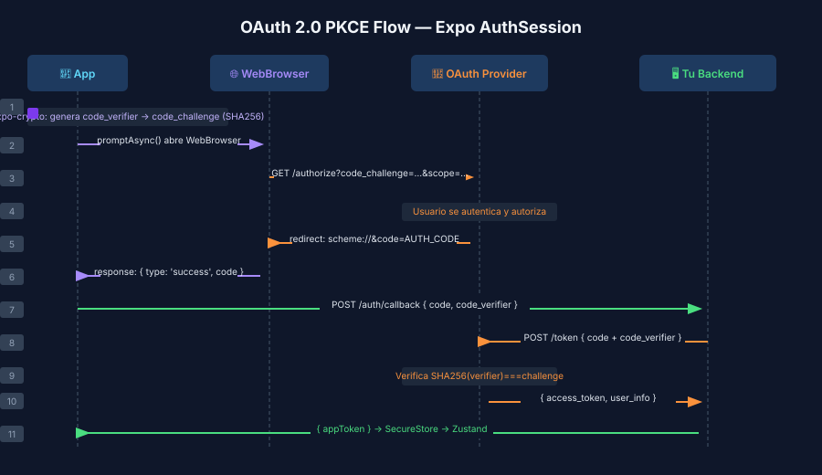

# OAuth y Expo AuthSession

## 🎯 Objetivos

- Comprender el flujo OAuth 2.0 Authorization Code con PKCE
- Implementar autenticación OAuth con `useAuthRequest` de Expo AuthSession
- Configurar `makeRedirectUri` correctamente en iOS y Android

## 📋 Contenido

### 1. ¿Por qué PKCE en aplicaciones móviles?

Las apps web pueden guardar un `client_secret` en el servidor. Las apps móviles **no** — el código fuente puede ser descompilado. PKCE (Proof Key for Code Exchange) resuelve este problema sin necesitar un secreto.

**Flujo PKCE en 5 pasos:**

```
1. App genera un code_verifier aleatorio (43–128 chars)
2. App calcula code_challenge = SHA256(code_verifier) en base64url
3. App abre browser → proveedor OAuth con code_challenge
4. Proveedor retorna authorization_code
5. App intercambia code + code_verifier → access_token
   (el proveedor verifica SHA256(code_verifier) === code_challenge)
```

`expo-crypto` genera el `code_verifier` de forma segura. `expo-auth-session` maneja el flujo completo automáticamente con `usePKCE: true` (activado por defecto).

---

### 2. Hook `useAuthRequest`

```ts
import * as AuthSession from 'expo-auth-session';
import * as WebBrowser from 'expo-web-browser';

// Necesario en web para cerrar la ventana popup al volver
WebBrowser.maybeCompleteAuthSession();

// Discovery document de GitHub
const discovery = {
  authorizationEndpoint: 'https://github.com/login/oauth/authorize',
  tokenEndpoint: 'https://github.com/login/oauth/access_token',
  revocationEndpoint: 'https://github.com/settings/connections/applications/{CLIENT_ID}',
};

function GitHubLoginButton(): React.JSX.Element {
  const redirectUri = AuthSession.makeRedirectUri({ scheme: 'bcauth08' });

  const [request, response, promptAsync] = AuthSession.useAuthRequest(
    {
      clientId: 'YOUR_GITHUB_CLIENT_ID',
      scopes: ['read:user', 'user:email'],
      redirectUri,
    },
    discovery,
  );

  // Procesar la respuesta cuando cambia
  React.useEffect(() => {
    if (response?.type === 'success') {
      const authCode = response.params.code;
      // Intercambiar code por access_token en tu backend
      // (nunca en el cliente — el backend mantiene el client_secret)
      exchangeCodeOnBackend(authCode);
    }
  }, [response]);

  return (
    <Pressable
      onPress={() => promptAsync()}
      disabled={!request}
    >
      <Text>Continuar con GitHub</Text>
    </Pressable>
  );
}
```

---

### 3. `makeRedirectUri` — la clave para el redirect URI

Expo AuthSession genera la redirect URI automáticamente según el entorno:

```ts
const redirectUri = AuthSession.makeRedirectUri({ scheme: 'bcauth08' });
// Development Build / Standalone: bcauth08://
// Expo Go:                         exp://127.0.0.1:8081/--/
// Web (dev):                       https://localhost:19006
```

Configura el `scheme` en `app.json`:

```json
{
  "expo": {
    "scheme": "bcauth08",
    "ios": { "bundleIdentifier": "com.tuapp.bcauth08" },
    "android": { "package": "com.tuapp.bcauth08" }
  }
}
```

> 🔧 El `scheme` personalizado solo funciona en builds nativos.
> En Expo Go, el redirect siempre es `exp://...`.

---

### 4. Intercambio de código en el backend

Por seguridad, el intercambio del `authorization_code` por el `access_token` **debe ocurrir en el servidor** (porque requiere el `client_secret`). En producción:

```
App → authorization_code → Tu backend → GitHub token endpoint → access_token → App
```

Para prototipos rápidos, `expo-auth-session` puede intercambiar el código directamente desde el cliente usando `AuthSession.exchangeCodeAsync`, pero solo cuando el proveedor soporte public clients (sin `client_secret`).

---

### 5. Proveedores populares

| Proveedor | Discovery doc | Notas |
|-----------|--------------|-------|
| **Google** | `https://accounts.google.com` | Usa `useAutoDiscovery`, requiere build nativo |
| **GitHub** | Manual (ver arriba) | No tiene discovery doc estándar |
| **Apple Sign In** | expo-apple-authentication | Módulo separado, solo iOS |
| **Cualquier OIDC** | `AuthSession.useAutoDiscovery(issuerUrl)` | OpenID Connect con auto-discovery |

```ts
// Google con auto-discovery
const discovery = AuthSession.useAutoDiscovery('https://accounts.google.com');
```

## 📚 Recursos Adicionales

- [Expo Authentication Guide](https://docs.expo.dev/develop/authentication)
- [RFC 7636 — PKCE spec](https://tools.ietf.org/html/rfc7636)
- [expo-auth-session docs SDK 57](https://docs.expo.dev/versions/v57.0.0/sdk/auth-session/)
- Diagrama PKCE: 

## ✅ Checklist de Verificación

- [ ] Entiendo para qué sirve el `code_verifier` y el `code_challenge`
- [ ] Sé configurar `makeRedirectUri` con el scheme de mi app
- [ ] `useAuthRequest` retorna `[request, response, promptAsync]`
- [ ] El intercambio de `code → token` ocurre en el backend (no en el cliente)
- [ ] `WebBrowser.maybeCompleteAuthSession()` está al top level para web
